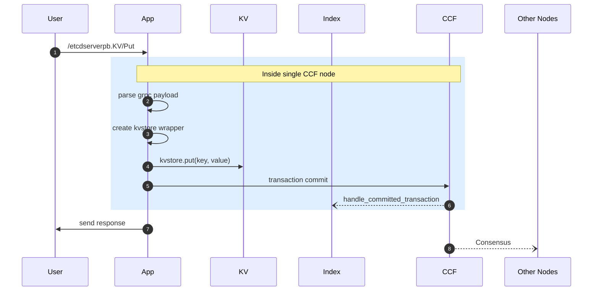
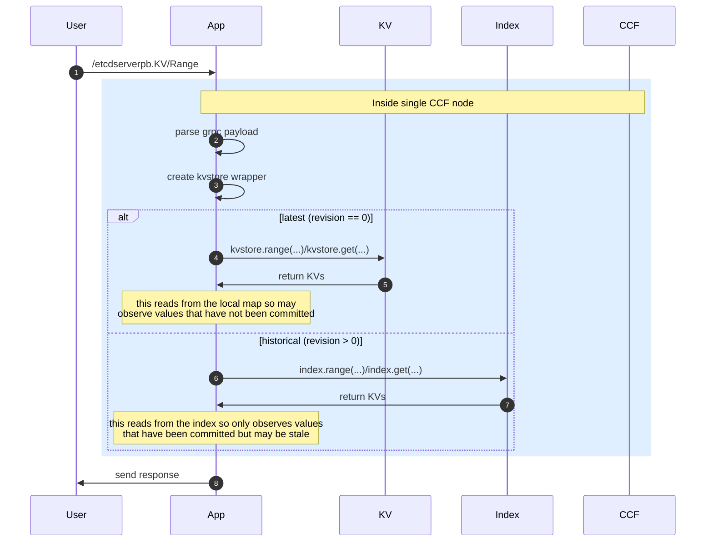
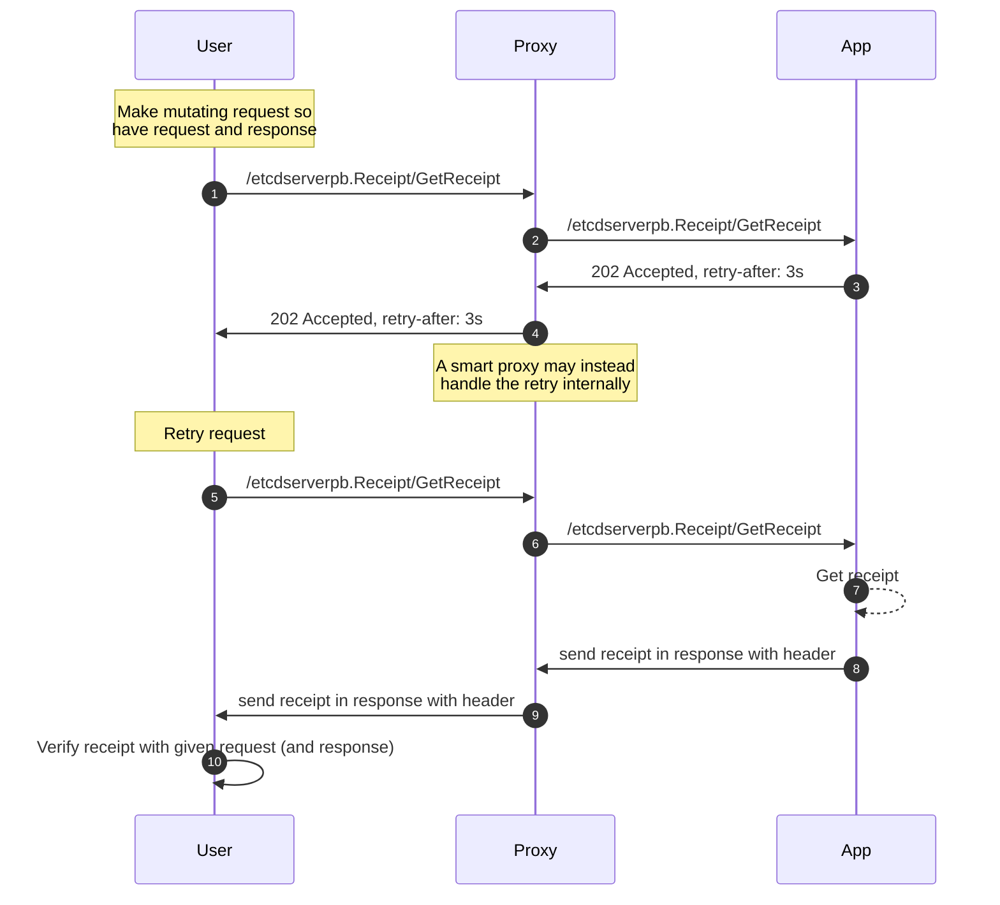

# LSKV

## Request flows

### Put

```mermaid
sequenceDiagram
    autonumber
    participant User
    participant App
    participant KV
    participant Index
    participant CCF
    participant Nodes as Other Nodes

    User->>App: /etcdserverpb.KV/Put
    rect rgba(191, 223, 255, 0.5)
    note over App,CCF: Inside single CCF node
    App->>App: parse grpc payload
    App->>App: create kvstore wrapper
    App->>KV: kvstore.put(key, value)
    App->>CCF: transaction commit
    CCF--)Index: handle_committed_transaction
    end
    App->>User: send response
    CCF--)Nodes: Consensus
```

### Range

```mermaid
sequenceDiagram
    autonumber
    participant User
    participant App
    participant KV
    participant Index
    participant CCF

    User->>App: /etcdserverpb.KV/Range
    rect rgba(191, 223, 255, 0.5)
    note over App,CCF: Inside single CCF node
    App->>App: parse grpc payload
    App->>App: create kvstore wrapper
    alt latest (revision == 0)
        App->>KV: kvstore.range(...)/kvstore.get(...)
        KV->>App: return KVs
        note over App: this reads from the local map so may <br>observe values that have not been committed
    else historical (revision > 0)
        App->>Index: index.range(...)/index.get(...)
        Index->>App: return KVs
        note over App: this reads from the index so only observes values<br> that have been committed but may be stale
    end
    end
    App->>User: send response
```

### Receipts

See [Receipts](./receipts.md) for how to verify the receipt.

```mermaid
sequenceDiagram
    autonumber
    participant User
    participant Proxy
    participant App

    note over User: Make mutating request so <br>have request and response

    User->>Proxy: /etcdserverpb.Receipt/GetReceipt
    Proxy->>App: /etcdserverpb.Receipt/GetReceipt
    App->>Proxy: 202 Accepted, retry-after: 3s
    Proxy->>User: 202 Accepted, retry-after: 3s
    note over Proxy: A smart proxy may instead <br>handle the retry internally
    note over User: Retry request
    User->>Proxy: /etcdserverpb.Receipt/GetReceipt
    Proxy->>App: /etcdserverpb.Receipt/GetReceipt
    App-->>App: Get receipt
    App->>Proxy: send receipt in response with header
    Proxy->>User: send receipt in response with header
    User->>User: Verify receipt with given request (and response)
```
