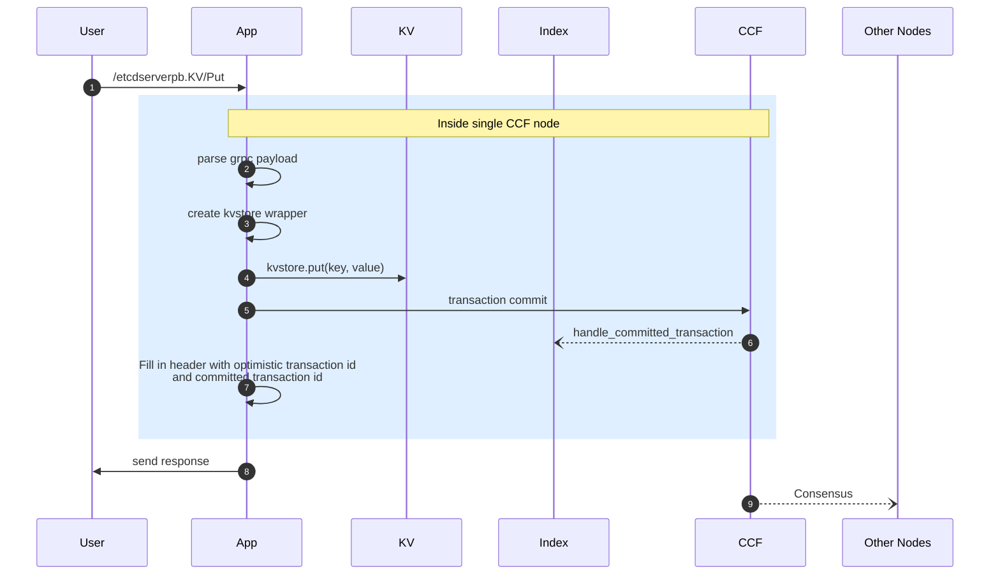
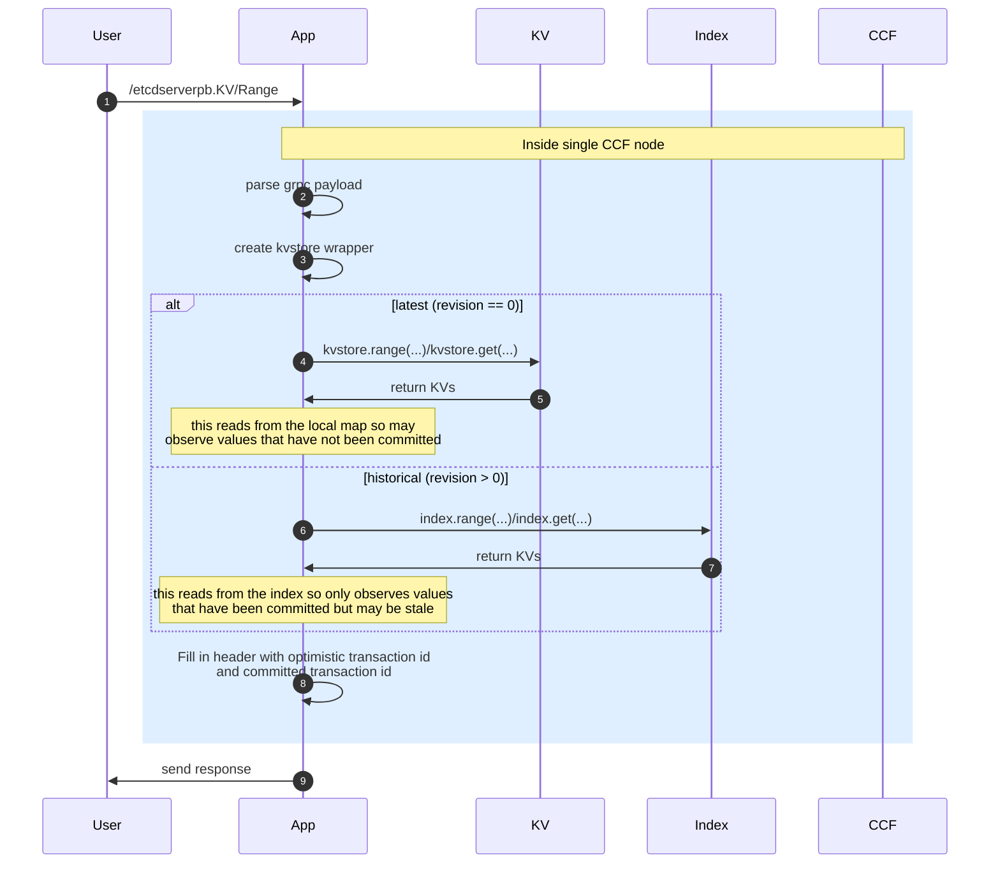

# LSKV

## Request flows

### Put

```mermaid
sequenceDiagram
    autonumber
    participant User
    participant App
    participant KV
    participant Index
    participant CCF
    participant Nodes as Other Nodes

    User->>App: /etcdserverpb.KV/Put
    rect rgba(191, 223, 255, 0.5)
    note over App,CCF: Inside single CCF node
    App->>App: parse grpc payload
    App->>App: create kvstore wrapper
    App->>KV: kvstore.put(key, value)
    App->>CCF: transaction commit
    CCF--)Index: handle_committed_transaction
    App->>App: Fill in header with optimistic transaction id<br> and committed transaction id
    end
    App->>User: send response
    CCF--)Nodes: Consensus
```

### Range

```mermaid
sequenceDiagram
    autonumber
    participant User
    participant App
    participant KV
    participant Index
    participant CCF

    User->>App: /etcdserverpb.KV/Range
    rect rgba(191, 223, 255, 0.5)
    note over App,CCF: Inside single CCF node
    App->>App: parse grpc payload
    App->>App: create kvstore wrapper
    alt latest (revision == 0)
        App->>KV: kvstore.range(...)/kvstore.get(...)
        KV->>App: return KVs
        note over App: this reads from the local map so may <br>observe values that have not been committed
    else historical (revision > 0)
        App->>Index: index.range(...)/index.get(...)
        Index->>App: return KVs
        note over App: this reads from the index so only observes values<br> that have been committed but may be stale
    end
    App->>App: Fill in header with optimistic transaction id<br> and committed transaction id
    end
    App->>User: send response
```
