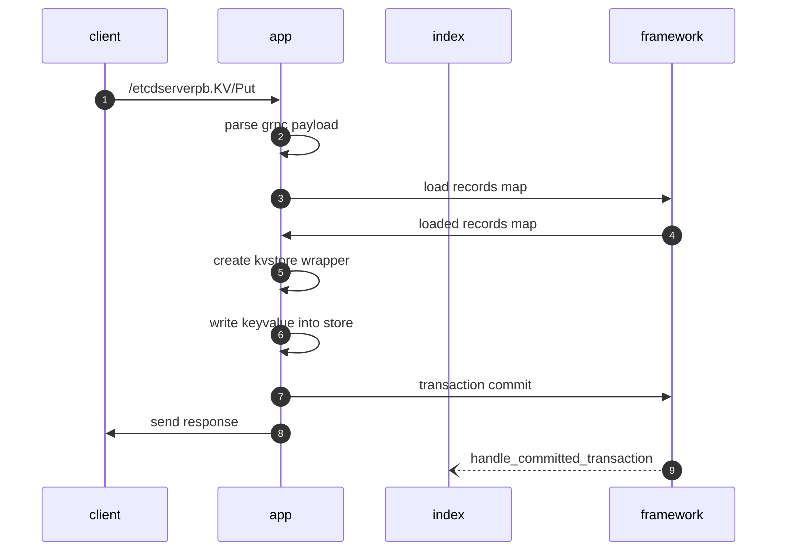
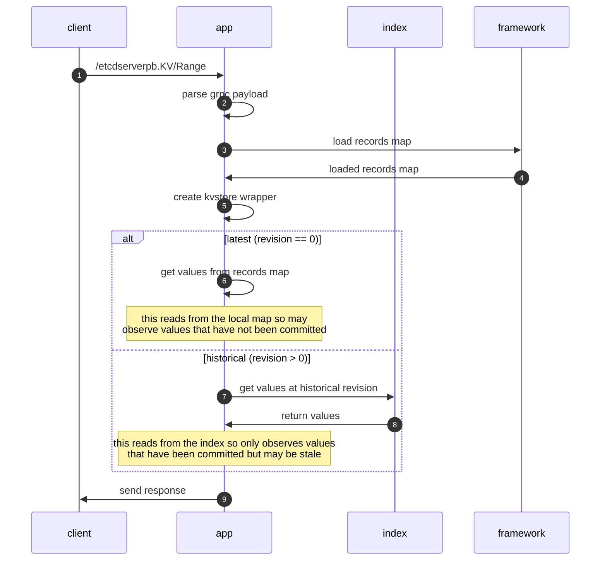

# CCF KVS

## Request flows

### Put

```mermaid
sequenceDiagram
    autonumber
    participant client
    participant app
    participant index
    participant framework

    client->>app: /etcdserverpb.KV/Put
    app->>app: parse grpc payload
    app->>framework: load records map 
    framework->>app: loaded records map
    app->>app: create kvstore wrapper
    app->>app: write keyvalue into store 
    app->>framework: transaction commit
    app->>client: send response
    framework--)index: handle_committed_transaction
```

### Range

```mermaid
sequenceDiagram
    autonumber
    participant client
    participant app
    participant index
    participant framework

    client->>app: /etcdserverpb.KV/Range
    app->>app: parse grpc payload
    app->>framework: load records map 
    framework->>app: loaded records map
    app->>app: create kvstore wrapper
    alt latest (revision == 0)
        app->>app: get values from records map
        note over app: this reads from the local map so may <br>observe values that have not been committed
    else historical (revision > 0)
        app->>index: get values at historical revision
        index->>app: return values
        note over app: this reads from the index so only observes values<br> that have been committed but may be stale
    end
    app->>client: send response
```
